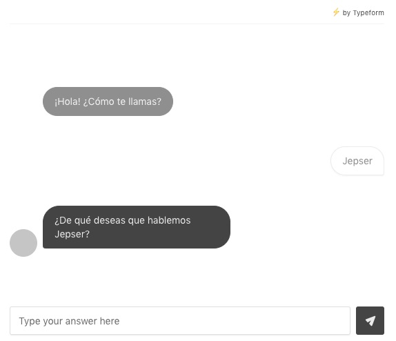

# React CUI
React wrapper for CUI Typeform render.

## What the h*ll is this?

 

At Typeform, we created a new (and we hope) useful way to render your forms, in a more conversational way.

And this is it. If you're not part of our Alpha test yet, [join us!](https://labs.typeform.com/cui/)

## Installation

1. Add the script `yarn add react-cui` or `npm install --save react-cui`
2. Import it
``` js
import Cui from 'react-cui'

<Cui uid='abc123' />
```

## Reference

- `uid` {string} - Typeform form ID
- `height` {number,string} - The height of the embed after the conversation starts
- `avatar` {string} - url of the avatar for the conversation
- `theme` {string} - color of the main theme color for the embed, access any type of color format

## Events API
 - `cui:init` with the payload: `{ uid }`
- `cui:reply` with the payload: `{ answer }`
- `cui:completed` with the payload: `{ answers }`

### Example
``` html
<div class="cui-embed" id="cui-event" data-cui-uid="abcdfe"></div>
```

``` js
const embedElement = document.getElementById('cui-event')
embedElement.addEventListener('cui:reply', function (e) {
  console.log('reply event', e.detail)
})
```
